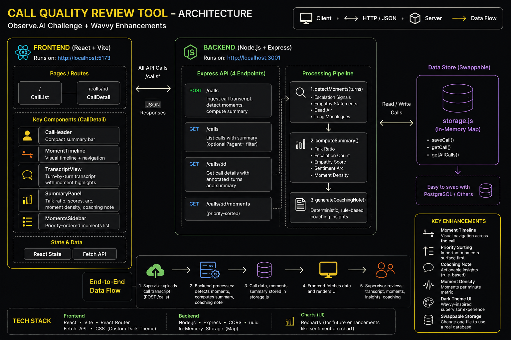

<div align="center">

# Call Quality Review Tool



<br/>

**An internal supervisor tool for contact-centre quality assurance.**  
Ingest call transcripts · auto-detect key moments · review a clean annotated UI — no recording playback required.

<br/>


</div>

---

## What It Does

A supervisor opens the tool, uploads a JSON transcript, and immediately sees:

| Signal | What's Detected |
|--------|----------------|
| 🔴 **Escalation** | Customer uses charged language — *cancel, refund, manager, lawsuit, ridiculous, unacceptable* |
| 🟢 **Empathy** | Agent demonstrates empathy — *"I completely understand"*, *"I'm sorry"*, *"I can see why"* (regex, not substring) |
| 🟠 **Dead Air** | Gap between consecutive turns exceeds **15 seconds** |
| 🔵 **Long Monologue** | Any turn exceeds **50 words** |

Detected moments are priority-ordered (`Escalation → Dead Air → Monologue → Empathy`), visualised on a proportional timeline, and surfaced in a coaching note — all computed in milliseconds from pure rule-based logic with no AI or API calls.

---

## Quick Start

```bash
# Backend — port 3001
cd backend && npm install && npm run dev

# Frontend — port 5173  (new terminal)
cd frontend && npm install && npm run dev
```

Open **http://localhost:5173** — upload one of the example transcripts in [`examples/`](examples/) to see the full review UI.

---

## Example Transcripts

Ready-made JSON files in [`examples/`](examples/) to demo every UI state:

| File | Moments | Purpose |
|------|---------|---------|
| [`c001-frustrated-refund.json`](examples/c001-frustrated-refund.json) | Escalation + Empathy + Dead Air | Core happy path |
| [`c002-billing-dispute.json`](examples/c002-billing-dispute.json) | Multiple escalations | High-priority sidebar ordering |
| [`c003-tech-support-outage.json`](examples/c003-tech-support-outage.json) | Dead Air + Long Monologue | Mixed moment types |
| [`c004-cancellation-save.json`](examples/c004-cancellation-save.json) | Escalation → Empathy recovery | Sentiment arc: improved |
| [`c005-escalation-spiral.json`](examples/c005-escalation-spiral.json) | Dense escalation chain | Coaching note: no empathy |
| [`demo-no-moments.json`](examples/demo-no-moments.json) | **0 moments** | "No moments detected" empty state |
| [`demo-empty-turns.json`](examples/demo-empty-turns.json) | **0 turns** | Empty transcript edge case |
| [`demo-invalid-body.json`](examples/demo-invalid-body.json) | — | Triggers client-side validation error |

---

## API Reference

Base URL: `http://localhost:3001`

### `POST /calls` — Ingest a transcript

```bash
curl -X POST http://localhost:3001/calls \
  -H "Content-Type: application/json" \
  -d '{
    "callId":    "c001",
    "agentName": "Priya",
    "duration":  240,
    "turns": [
      { "speaker": "agent",    "text": "Thank you for calling, how can I help?", "t": 0 },
      { "speaker": "customer", "text": "This is completely unacceptable. I want a refund.", "t": 7 },
      { "speaker": "agent",    "text": "I completely understand your frustration.", "t": 48 },
      { "speaker": "customer", "text": "I want to speak to a manager.", "t": 60 }
    ]
  }'
```

**Response `201`**
```json
{ "callId": "c001", "momentCount": 4 }
```

**Validation errors `400`** — missing fields, wrong types, duplicate `callId`, invalid turn shape.

---

### `GET /calls` — List all calls

```bash
curl http://localhost:3001/calls
curl "http://localhost:3001/calls?agent=Priya"   # case-insensitive filter
```

**Response**
```json
[
  {
    "callId": "c001",
    "agentName": "Priya",
    "duration": 240,
    "momentCount": 4,
    "empathyScore": 0.5,
    "sentimentArc": "improved",
    "escalationCount": 2,
    "createdAt": "2024-01-01T10:00:00.000Z"
  }
]
```

---

### `GET /calls/:id` — Full annotated call

Returns each turn with its detected moments attached, plus the full summary.

```bash
curl http://localhost:3001/calls/c001
```

**Response shape**
```json
{
  "callId": "c001",
  "agentName": "Priya",
  "duration": 240,
  "annotatedTurns": [
    {
      "speaker": "customer",
      "text": "This is completely unacceptable...",
      "t": 7,
      "turnIndex": 1,
      "moments": [
        { "id": "uuid", "type": "escalation", "matchedText": "unacceptable", "priority": 4 }
      ]
    }
  ],
  "summary": {
    "talkRatio": { "agent": 60, "customer": 40 },
    "escalationCount": 2,
    "empathyScore": 0.5,
    "sentimentArc": "improved",
    "totalMoments": 4,
    "momentDensity": 1.0,
    "coachingNote": "Customer escalated before empathy was shown. Consider acknowledging concerns earlier."
  }
}
```

---

### `GET /calls/:id/moments` — Priority-sorted moments

```bash
curl http://localhost:3001/calls/c001/moments
```

Returns the moments array sorted `priority desc → t asc` — the same order shown in the sidebar.

---

### `DELETE /calls/:id` — Remove a call

```bash
curl -X DELETE http://localhost:3001/calls/c001
```

**Response `200`**
```json
{ "deleted": "c001" }
```

---

## UI Features

### Supervisor Inbox (Call List)

- **Metrics bar** — total calls, average empathy score, total escalations, critical-call ratio
- **Agent filter** — debounced live search hits the backend `?agent=` filter
- **Sentiment segment control** — filter by Improved / Neutral / Declined arc
- **Sortable columns** — duration, empathy score, escalation count, moment count, ID
- **Per-row delete** — trash icon appears on hover; first click enters confirm state (red tint), second click deletes

### Call Detail View

- **Call header** — agent name, ID, duration, moment count, sentiment arc badge, escalation count with pulsing indicator
- **Conversation waveform** — 80-bar visual representation of the call; yellow = agent, blue = customer, flat = dead air. Click any bar to jump to that turn. TTS playback with speed control (1×, 1.5×, 2×) and dual-voice channel split
- **Moment timeline** — full-width proportional strip; coloured dots at `(moment.t / duration) × 100%`; hover for tooltip, click to scroll and highlight the turn
- **Annotated transcript** — colour-coded left border (highest-priority moment colour), inline type badges, speaker chip, mm:ss timestamp
- **Summary panel** — talk ratio bar, empathy score (colour-graded), sentiment arc, moment density, coaching note
- **Moments sidebar** — priority-sorted list; click any entry to scroll and flash the transcript row
- **Delete call** — two-step confirm in the header (animates red on confirm step)

---

## Moment Detection Rules

```
detectMoments(turns) → moments[]       // pure function — no I/O, no side effects
```

| Type | Speaker | Detection logic |
|------|---------|----------------|
| `escalation` | customer | `/\b(cancel\|refund\|manager\|lawsuit\|ridiculous\|unacceptable)\b/i` |
| `empathy` | agent | `/i.*understand/i` · `/i.?m sorry/i` · `/i apologise/i` · `/i can see why/i` |
| `dead_air` | resuming speaker | `turns[i].t - turns[i-1].t > 15` |
| `long_monologue` | either | word count > 50 |

A single turn can produce **multiple moments** (a 60-word customer turn containing "cancel" fires both `escalation` and `long_monologue`).

Moments are sorted by **priority descending, then timestamp ascending** — highest-severity signals always appear first in the sidebar regardless of when they occurred.

---

## Computed Summary Fields

| Field | Formula |
|-------|---------|
| `talkRatio` | `{ agent, customer }` as integer % of total turn count |
| `escalationCount` | `moments.filter(m => m.type === 'escalation').length` |
| `empathyScore` | `min(1.0, empathy / (empathy + escalation))` · `1.0` if no escalations |
| `sentimentArc` | First-half vs second-half escalation distribution → `improved` / `declined` / `neutral` |
| `totalMoments` | `moments.length` |
| `momentDensity` | `totalMoments / (duration / 60)` rounded to 2 dp |
| `coachingNote` | First-match deterministic rule (see below) |

### Coaching Note Rules (priority order)

1. Escalation present + zero empathy → *"Consider acknowledging concerns earlier"*
2. Empathy appeared **after** first escalation → *"Consider acknowledging concerns earlier"*
3. ≥ 2 dead-air periods → *"Review account lookup and hold workflows"*
4. 1 dead-air period → *"Avoid extended silences during account lookup"*
5. Long customer monologue → *"Consider proactive clarification earlier"*
6. Long agent monologue → *"Keep responses concise"*
7. Empathy present, no escalation → *"Strong empathy demonstrated throughout the call"*
8. Default → *"Call completed without notable coaching concerns"*

---

## Architecture Decisions

### Repository pattern (`storage.js`)

`storage.js` is the only file aware of how data is persisted. It exports five functions: `saveCall`, `getCall`, `getAllCalls`, `callExists`, `deleteCall`. Every route, detection module, and summary engine calls these functions and knows nothing about the underlying store. Migrating to PostgreSQL means writing one new file — zero changes anywhere else.

### In-memory store

A `Map<callId, CallRecord>` keeps the demo self-contained with zero infrastructure. All metrics are computed once at ingestion time and stored in a denormalised shape, so every read endpoint is an O(1) lookup — no recomputation on GET.

### Pure detection engine

`detectMoments` is a pure function: `turns → moments[]`. No I/O, no HTTP calls, no mutable state outside the function body. This makes it trivially unit-testable, reusable in a batch processor or real-time stream worker, and safe to run in any context.

### Regex over `.includes()` for empathy

`text.includes("I understand")` silently misses *"I **completely** understand"* and *"I **really** understand"*. The regex `/i.*understand/i` correctly matches all natural phrasings without introducing false positives from words like "misunderstand".

### Priority-ordered moments

Assigning numeric priorities (Escalation=4, Dead Air=3, Long Monologue=2, Empathy=1) means the sidebar always surfaces the most actionable coaching signal first, regardless of when in the call it occurred. A supervisor scanning a 30-minute call sees the highest-risk moment within one second of opening the detail view.

### Deterministic coaching notes

Coaching notes are generated from a prioritised rule set with no AI, no external API, and no randomness. The same transcript always produces the same note — making the output auditable, explainable to agents, and reproducible in QA reviews.

---

## Project Structure

```
.
├── backend/
│   └── src/
│       ├── index.js            # Express entry — CORS, JSON middleware, port 3001
│       ├── constants.js        # MOMENT_TYPES, MOMENT_PRIORITY
│       ├── detectMoments.js    # Pure detection engine
│       ├── coaching.js         # Deterministic coaching rule engine
│       ├── summary.js          # Metric computation (calls coaching.js)
│       ├── storage.js          # In-memory Map — swap this file for any DB
│       └── routes/
│           └── calls.js        # All five REST endpoints
│
├── frontend/
│   └── src/
│       ├── api.js              # Fetch wrappers for all endpoints
│       ├── constants.js        # MOMENT_COLORS, MOMENT_LABELS, MOMENT_PRIORITY
│       ├── App.jsx             # React Router v6 — / and /calls/:id
│       └── components/
│           ├── CallList.jsx        # Supervisor inbox with metrics and filters
│           ├── CallDetail.jsx      # Full review layout + TTS engine
│           ├── CallHeader.jsx      # Agent summary bar + delete confirm
│           ├── MomentTimeline.jsx  # Proportional visual strip
│           ├── TranscriptView.jsx  # Annotated turns with moment badges
│           ├── SummaryPanel.jsx    # Metrics + coaching note card
│           ├── MomentsSidebar.jsx  # Priority-ordered clickable moment list
│           └── TranscriptUpload.jsx # Drag-drop uploader with schema preview
│
├── examples/                   # Ready-made transcript JSON files for testing
├── docs/
│   └── architecture.png        # System architecture diagram
├── architecture.html           # Interactive architecture diagram (open in browser)
└── README.md
```

---

## Future Enhancements

| Enhancement | Description |
|------------|-------------|
| **Real-time ingestion** | WebSocket / SSE stream from telephony platform; moments detected as turns arrive |
| **Live supervisor alerts** | Push notification when an escalation signal fires mid-call |
| **Escalation prediction** | ML scoring layer on top of keyword rules; predicts churn probability before "cancel" is spoken |
| **Silence trend analysis** | Aggregate dead-air patterns across an agent's call history to surface systemic workflow delays |
| **Agent coaching briefs** | Personalised coaching summaries generated from rolling moment history across sessions |
| **Multi-call analytics** | Team dashboards — escalation rates, average empathy, dead-air frequency by shift and queue |
| **Quality scorecards** | Configurable rubrics mapping moment counts to supervisor review scores |
| **PostgreSQL migration** | Replace `storage.js` with a single `pg-storage.js` adapter; zero other file changes required |

---

<div align="center">
  Built for the <strong>Observe.AI Challenge</strong> · Enhanced with Wavvy supervisor-first UX principles
</div>
